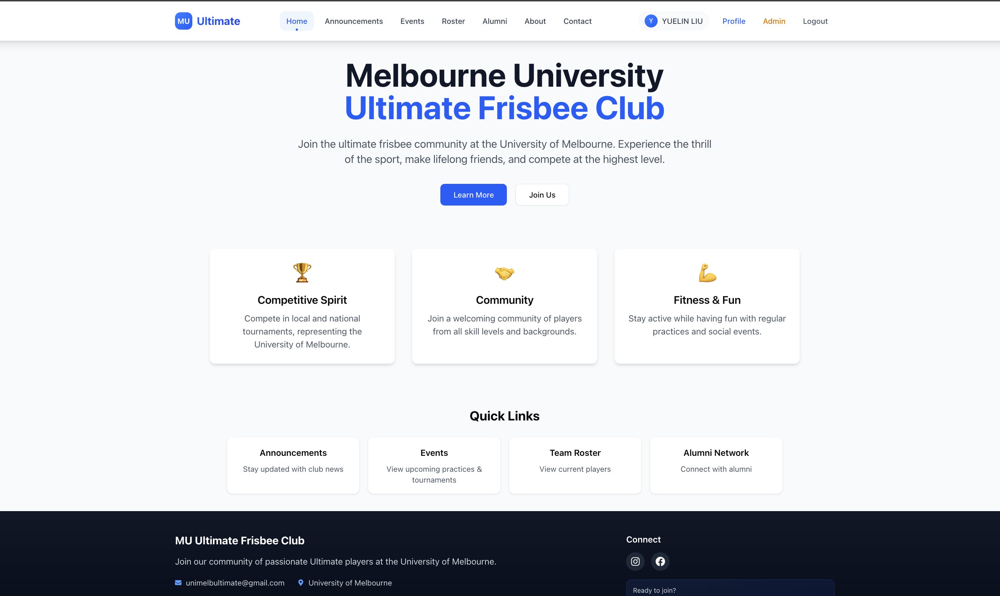
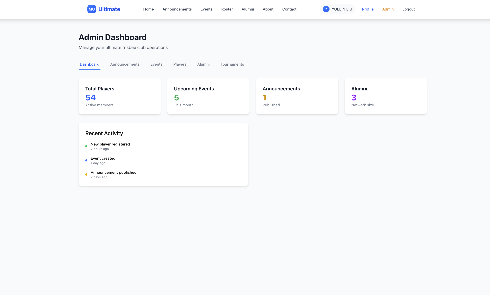
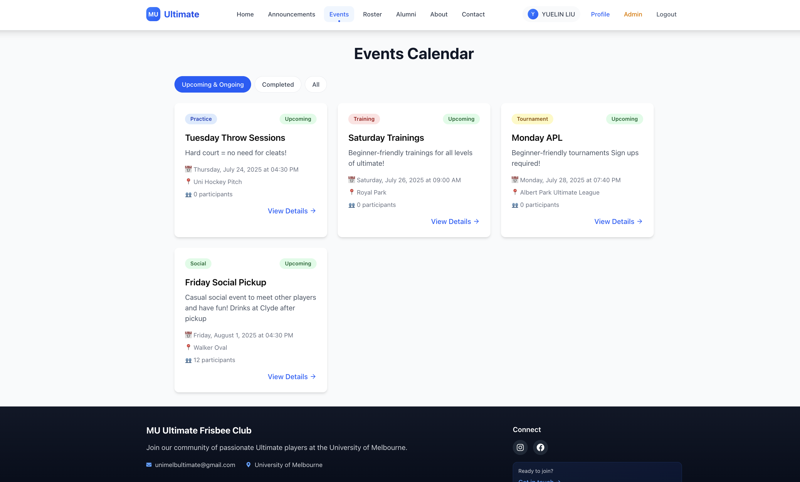

# 🥏 Melbourne University Ultimate Frisbee Club

[](https://github.com/liuyuelintop/melb-uni-ultimate/stargazers)
[](https://github.com/liuyuelintop/melb-uni-ultimate/network/members)
[](https://github.com/liuyuelintop/melb-uni-ultimate/graphs/contributors)
[](https://nextjs.org/)
[](https://www.typescriptlang.org/)
[](https://tailwindcss.com/)
[](https://www.mongodb.com/)
[](https://vercel.com/)
[](LICENSE)

> **A modern, open-source web platform for ultimate frisbee clubs. Built for the Melbourne University Ultimate community—ready for your team!**

---

## 🌍 Live Demo

**Try it now:** [https://melb-uni-ultimate.vercel.app](https://melb-uni-ultimate.vercel.app)  
_(Or deploy your own in minutes!)_

---

## ✨ Why Star This Project?

- **Beautiful, modern UI** with Tailwind, shadcn/ui, and Lucide icons
- **All-in-one club management**: events, announcements, roster, alumni, tournaments, and more
- **Admin dashboard** for easy content and user management
- **Open source, MIT licensed** – ready for your club or team!
- **Easy deploy to Vercel** (or your own server)
- **Active development & welcoming to contributors**
- **Trusted by the Melbourne University Ultimate community**

---

## 🎬 Demo

| Home Page                          | Admin Dashboard                      | Events Calendar                        |
| ---------------------------------- | ------------------------------------ | -------------------------------------- |
|  |  |  |

---

## 🏆 Who's Using This?

- **Melbourne University Ultimate Frisbee Club**
- _Your club here! [Open a PR to add yours!]_

---

## 🚀 Features

### 🏠 Public Pages

- **Home**: Club intro, quick links, and highlights
- **About**: Club history, values, and leadership
- **Announcements**: News, updates, and important info
- **Events**: Practice, tournament, and social event calendar
- **Roster**: Public team roster with gender/role badges and filters
- **Alumni**: Connect with past members
- **Contact**: Easy contact form for inquiries

### 🔒 Member & Admin Features

- **Profile**: Secure member profiles
- **Admin Dashboard**: Manage announcements, events, players, alumni, and tournaments in one place
- **CRUD**: Create, edit, and delete content with confirmation dialogs and notifications
- **Role-based access**: NextAuth.js with admin/member/public roles
- **Modern UI/UX**: Responsive, accessible, and mobile-friendly

---

## 🛠️ Tech Stack

- **Next.js 15** (App Router, SSR, API routes)
- **TypeScript** (strict types everywhere)
- **Tailwind CSS** + **shadcn/ui** (customizable, beautiful components)
- **MongoDB** + **Mongoose** (robust data models)
- **NextAuth.js** (secure authentication)
- **Lucide React** (iconography)
- **Jest** (unit tests)
- **ESLint, Prettier, Husky** (code quality)

---

## ⚡ Quick Start

```bash
git clone https://github.com/your-username/melb-uni-ultimate.git
cd melb-uni-ultimate
npm install
cp docs/env.template .env.local # or set up your own env vars
npm run dev
```

- Visit [http://localhost:3000](http://localhost:3000)
- Sign up as a new user, or log in as admin (see docs/DEPLOYMENT_READY.md for admin setup)

---

## 🗂️ Project Structure

```
melb-uni-ultimate/
├── app/                # Next.js App Router (public, protected, admin, api)
├── components/         # UI and feature components (atomic design)
├── lib/                # Auth, DB, and utility libraries
├── data/               # Static data
├── public/             # Static assets (images, icons)
├── styles/             # Tailwind/global styles
├── docs/               # Deployment, env, and screenshot docs
└── types/              # Shared TypeScript types
```

---

## 🛡️ Authentication & Roles

- **Public**: Anyone can view public pages
- **Member**: Authenticated users get access to protected features
- **Admin**: Full access to dashboard and management tools

---

## 🏗️ Deployment

### Vercel (Recommended)

- Push to GitHub
- Connect repo to Vercel
- Set environment variables ([see template](docs/env.template))
- Deploy!

### Manual

```bash
npm run build
npm start
```

---

## 🤔 Why Ultimate Frisbee?

Ultimate Frisbee is a fast-growing, inclusive sport that builds teamwork, spirit, and fitness. This project aims to empower clubs and communities worldwide with modern tools—join us and help grow the sport!

---

## 🧑‍💻 Contributing

We welcome contributions! To get started:

1. Fork this repo
2. Create a feature branch (`git checkout -b feature/your-feature`)
3. Commit and push your changes
4. Open a Pull Request

**Please read [docs/DEPLOYMENT_READY.md](docs/DEPLOYMENT_READY.md) for workflow and code standards.**

---

## 💬 Community & Support

- [Contact page](http://localhost:3000/contact) for club questions
- [GitHub Issues](https://github.com/your-username/melb-uni-ultimate/issues) for bugs/feature requests
- [Vercel Discussion](https://vercel.com/support) for deployment help

---

## 🙋 FAQ

**Q: Can I use this for my own club?**  
A: Yes! It’s open source and easy to customize.

**Q: Is it free?**  
A: 100% MIT licensed.

**Q: How do I get admin access?**  
A: See [docs/DEPLOYMENT_READY.md](docs/DEPLOYMENT_READY.md).

---

## 🙏 Sponsors & Backers

_Sponsor this project and help us grow Ultimate!_  
[Become a sponsor](https://github.com/sponsors/your-username)

---

## 📄 License

MIT License. See [LICENSE](LICENSE).

---

## ⭐️ Star This Project!

If you like this project, please **star it on GitHub** and share it with your club or team. Your support helps us grow the Ultimate community!

---

**Go Ultimate! 🥏**
