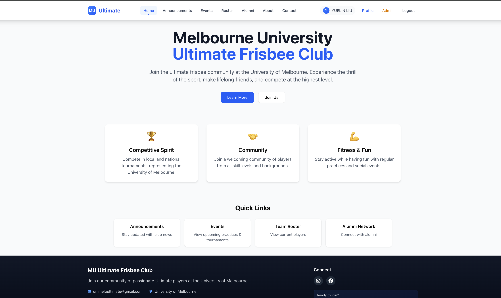
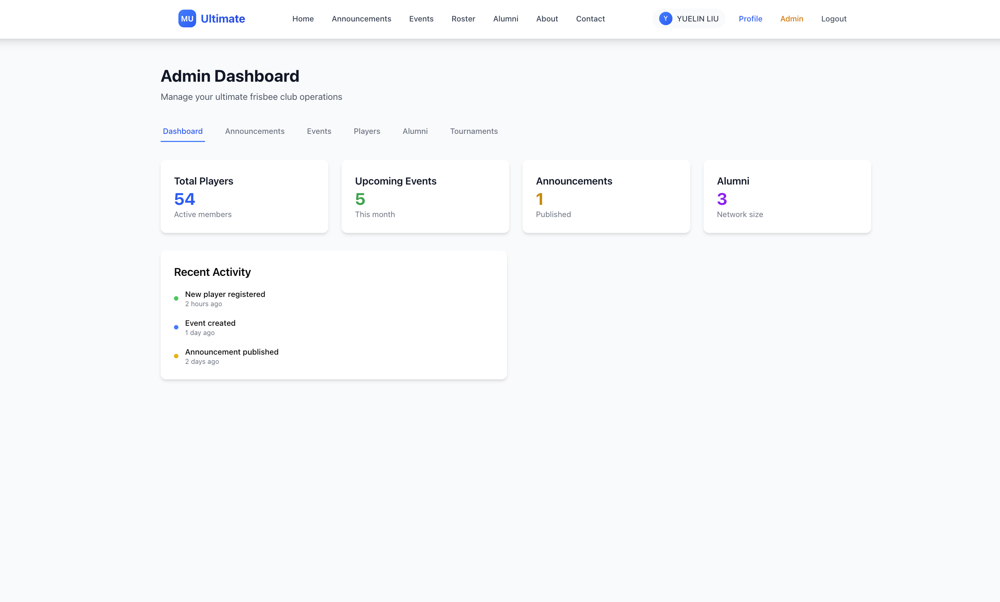
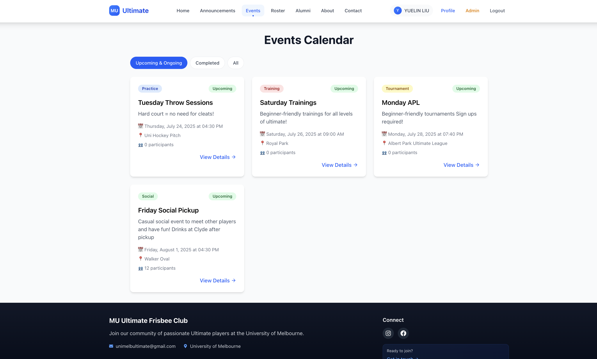

# 🥏 Melbourne University Ultimate Frisbee Club

[](https://nextjs.org/)
[](https://react.dev/)
[](https://www.typescriptlang.org/)
[](https://tailwindcss.com/)
[](https://mongoosejs.com/)
[](https://vercel.com/)

> A club website for Melbourne University Ultimate: roster and tournament
> selection, events, announcements, alumni and video content, behind an admin
> dashboard. Built with Next.js 15 and MongoDB.

---

## 📌 Project status

- **Built:** July 2025. **Not actively maintained** — treat it as a finished
  project rather than a live one.
- **Source is public, but there is no licence.** See [Licence](#-licence) below.
  This is not an open-source project in the OSI sense.
- Single-club application. Club name, branding and copy are hardcoded in a handful
  of files; it is not a configurable multi-club template.

---

## 🌍 Deployment

[https://melb-uni-ultimate.vercel.app](https://melb-uni-ultimate.vercel.app)

The application needs a MongoDB connection to serve any data-driven page. If the
database is unavailable or paused, pages will render with empty data regions.

---

## 🎬 Screenshots

| Home Page                          | Admin Dashboard                      | Events                                 |
| ---------------------------------- | ------------------------------------ | -------------------------------------- |
|  |  |  |

---

## 🚀 Features

### 🏠 Public pages

- **Home**: club intro, quick links and highlights
- **About**: club history, values and leadership (static content)
- **Announcements**: published club news, with a detail page per item
- **Events**: practice, tournament and social events, with status derived from
  start/end dates (upcoming / ongoing / completed)
- **Videos**: YouTube embeds, filtered to published and publicly visible items
- **Roster**: team roster with gender and position badges, search and filters
- **Alumni**: alumni directory; contact and employment fields are withheld from
  non-admin callers **server-side**, not merely hidden in the UI
- **Contact**: club contact details and social links (no submission form)

### 🔒 Member and admin features

- **Profile**: authenticated member profile
- **Admin dashboard** (`/dashboard`): a single tabbed surface for announcements,
  events, videos, players, alumni and tournaments
- **Tournament rosters**: players are attached to tournaments through a
  normalised join collection with a compound unique index, so the same player
  cannot be selected twice for the same tournament and team
- **Video management**: add and edit YouTube videos, with URL/ID parsing, tag
  filtering, a publish flag and visibility filtering by audience
- **CRUD**: create, edit and delete with confirmation dialogs and toasts
- **Authentication**: NextAuth credentials provider, bcrypt password hashing,
  JWT sessions, and two roles — `user` and `admin`

---

## 🛠️ Tech stack

- **Next.js 15.4.2** (App Router, route handlers)
- **React 19.1.0**
- **TypeScript 5.8.3** — `strict` mode enabled
- **Tailwind CSS 4** + **shadcn/ui** (nine generated primitives, plus
  hand-written shared components)
- **MongoDB** + **Mongoose 8** (nine schemas with validators and indexes)
- **NextAuth 4** (credentials provider, JWT strategy)
- **Lucide React** and **react-icons** (iconography)
- **ESLint** (`next/core-web-vitals`, `next/typescript`)

There is **no automated test suite** and **no CI pipeline** in this repository.

---

## ⚡ Quick start

```bash
git clone https://github.com/liuyuelintop/melb-uni-ultimate.git
cd melb-uni-ultimate
npm install
cp docs/env.template .env.local   # then fill in your own values
npm run dev
```

- Visit [http://localhost:3000](http://localhost:3000)
- Sign up as a new user at `/signup`. New accounts get the `user` role.
- To create an admin, insert the user directly in the database and set
  `role: "admin"` on that document — see
  [docs/DEPLOYMENT_READY.md](docs/DEPLOYMENT_READY.md). There is deliberately no
  self-service route for granting admin.

Required environment variables are listed in
[`docs/env.template`](docs/env.template): `MONGODB_URI`, `NEXTAUTH_SECRET` and
`NEXTAUTH_URL`. Never commit their values.

---

## 🗂️ Project structure

```
melb-uni-ultimate/
├── src/
│   ├── app/                    # Next.js App Router
│   │   ├── (admin)/           # Admin pages (dashboard)
│   │   │   └── layout.tsx     # Server-side auth + admin role gate
│   │   ├── (auth)/            # Authentication pages (login, signup, unauthorized)
│   │   ├── (protected)/       # Protected member pages (profile)
│   │   ├── (public)/          # Public pages (about, announcements, events, videos, etc.)
│   │   ├── api/               # Route handlers
│   │   │   ├── (admin)/       # Dashboard stats
│   │   │   ├── (auth)/        # refresh, signup
│   │   │   ├── (protected)/   # players, tournaments, user, videos
│   │   │   ├── (public)/      # alumni, announcements, events, roster
│   │   │   └── auth/          # NextAuth.js routes
│   │   ├── layout.tsx         # Root layout
│   │   ├── page.tsx           # Home page
│   │   └── providers.tsx      # App providers
│   ├── features/              # Feature-based components and logic
│   │   ├── about/  admin/  alumni/  announcements/
│   │   ├── events/  roster/  tournaments/  videos/
│   ├── shared/                # Shared across features
│   │   ├── components/        # UI primitives, layout, home
│   │   ├── context/           # React contexts (notifications)
│   │   ├── data/              # Static page content
│   │   ├── hooks/             # useApi, useCrud and resource hooks
│   │   ├── lib/auth/          # NextAuth options + authorisation guards
│   │   ├── lib/db/            # Mongoose connection and models
│   │   └── types/             # Shared TypeScript types
│   ├── styles/                # Global styles
│   └── middleware.ts          # Next.js middleware
├── public/                    # Static assets
├── docs/                      # Deployment guides and env templates
└── package.json
```

### 🏗️ Architecture notes

- **Feature-based organisation**: each feature area owns its components under
  `src/features/<feature>/`.
- **Route groups**: Next.js route groups `()` organise files by intended access
  level. They are **naming only** — parentheses do not appear in the URL and
  confer no protection. The admin dashboard is served at `/dashboard`, not
  `/admin`. Authorisation is enforced in code, not by directory layout.
- **Shared layer**: common UI primitives, hooks and types live in `src/shared/`.
- **Authorisation**: `src/shared/lib/auth/guards.ts` is the single place that
  reads a session. Route handlers call `requireAdmin()` / `requireAuth()` and
  return the guard's response on failure, so a mutating endpoint cannot be
  written without an explicit decision about who may call it. See the
  "Authentication and authorisation" section below.
- **Data fetching**: a generic `useApi<T>` hook owns fetch/loading/error state;
  `useCrud<T>` composes it and adds create/update/delete with optimistic local
  list updates. The thirteen resource hooks in `src/shared/hooks/` are built on
  that pair.
- **Database connection**: `src/shared/lib/db/mongoose.ts` caches the connection
  promise on `global` and invalidates it on failure, so serverless invocations
  reuse one connection instead of exhausting the pool.

---

## 🛡️ Authentication and authorisation

Two roles exist in the data model: `user` and `admin`
(`src/shared/lib/db/models/user.ts`).

- **Public**: anyone can read public pages and the public read endpoints.
- **`user`**: any account created through signup. Can sign in and view protected
  member pages.
- **`admin`**: can reach `/dashboard` and the admin management surfaces.

**How authorisation works.** Every authorisation decision goes through
`src/shared/lib/auth/guards.ts`, which is the only module in the codebase that
calls `getServerSession`:

| Helper | Use |
| ------ | --- |
| `getViewer()` | Resolve the caller, or `null`. Returns `role` read from the database. |
| `viewerIsAdmin()` | For read endpoints that vary their output by role. |
| `requireAuth()` | Require any signed-in caller. |
| `requireAdmin()` | Require an admin. |

`requireAuth` and `requireAdmin` return a discriminated union, so a route reads:

```ts
const auth = await requireAdmin();
if (!auth.ok) return auth.response; // 401 or 403
// auth.viewer is typed as a Viewer from here on
```

Two deliberate properties:

- **`authOptions` cannot be forgotten.** `getServerSession()` populates
  `session.user.role` only when passed `authOptions`. Called without them it
  still returns a valid session, but with `role` undefined — so a role check
  silently rejects everyone, including real admins, and TypeScript cannot catch
  it because the parameter is optional. Having exactly one call site is the only
  reliable fix.
- **Roles come from the database, not the JWT claim.** The claim is written at
  sign-in and then fixed for the life of the token, so revoking an admin would
  not take effect until it expired. Reading the current value costs one indexed
  lookup and applies to the caller's next request. Anonymous callers skip the
  query entirely.

**How `/dashboard` is protected.** `src/app/(admin)/layout.tsx` is a server
component that calls `getViewer()` and redirects unauthenticated visitors to
`/login` and non-admins to `/unauthorized`. This is the authoritative gate.
`src/middleware.ts` additionally checks the JWT for `/dashboard` as defence in
depth.

**What each role can write.** Announcements, events, players, alumni, roster
entries and tournaments are admin-only for every mutating method. Members can
edit their own profile, and can add videos — a member's video is visible to
members only until an admin widens its audience, and members can edit or delete
only videos they created. `/api/signup` is intentionally open; new accounts get
the `user` role and there is no self-service route to `admin`.

---

## 🏗️ Deployment

### Vercel

- Push to GitHub and connect the repository to Vercel
- Set the environment variables from [`docs/env.template`](docs/env.template)
- Deploy

### Manual

```bash
npm run build
npm start
```

---

## 🧑‍💻 Contributing

This repository has **no licence**, which means external contributions cannot be
accepted as things stand — a contributor has no grant to build on, and the
project has no terms to accept contributions under. If you want to collaborate,
open an issue first so licensing can be sorted out.

If you are working on a fork for your own reference:

1. Create a feature branch (`git checkout -b feature/your-feature`)
2. Keep commits scoped and descriptive
3. Run `npx tsc --noEmit` and `npm run build` before pushing — there is no CI to
   catch breakage for you

---

## 💬 Contact

- Club enquiries: see the [contact page](https://melb-uni-ultimate.vercel.app/contact)
- Bugs and questions about the code:
  [GitHub Issues](https://github.com/liuyuelintop/melb-uni-ultimate/issues)

---

## 🙋 FAQ

**Q: Can I use this for my own club?**
A: Not as-is. There is no licence granting you the right to use, modify or
redistribute the code, and the club's name and content are hardcoded throughout.
Open an issue if you would like to discuss it.

**Q: Is it free?**
A: The source is publicly readable, but it is not licensed for reuse. "Public"
and "open source" are not the same thing.

**Q: How do I get admin access?**
A: Set `role: "admin"` on your user document directly in the database. See
[docs/DEPLOYMENT_READY.md](docs/DEPLOYMENT_READY.md).

**Q: Are there tests?**
A: No. There is no test suite and no CI pipeline.

---

## 📄 Licence

**None.** No licence file has been added to this repository, so default copyright
applies and all rights are reserved. The source is readable because the
repository is public; that is not a grant of permission to use, copy, modify or
redistribute it.

---

**Go Ultimate! 🥏**
